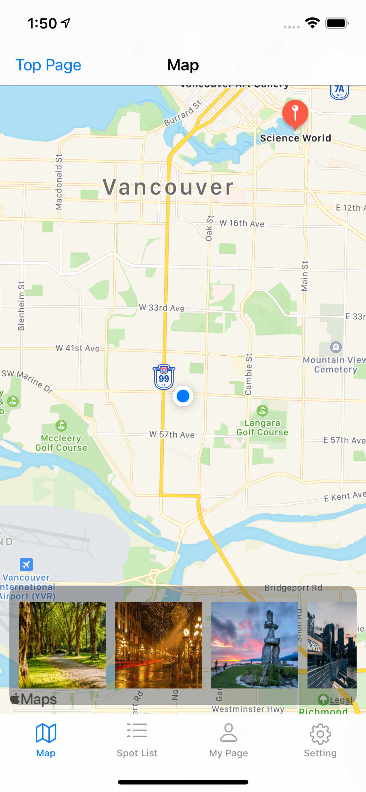
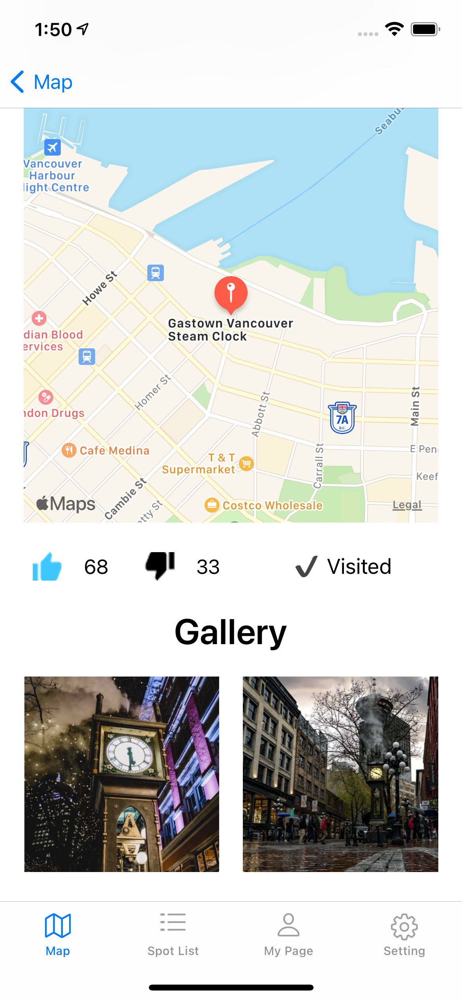

Famus Sport Tour
===
[Original Repo](https://github.com/TakayasuNasu/FamousSpotTour)


Whtat's Famus Sport Tour
---

An application that gives tourists suggestions on where to go in Vancouver.

For who?
---

Tourists
International students

What's solving?
---

Suggest places to go if you are not sure where to go.
Offer a lesser known place to go.
To some extent, you have narrowed down your choices.

Dependency
---

```bash
swift: 5.3.2
```

Screen Shots
---

| | | | |
|-|-|-|-|
|||||
|||||


Features
---

1. Find famous spot in Vancouver.
1. Direction how to go
1. Know Spot information.

Installation
---

```bash
pod install
```

Reference
---

- [Spec - Figma](https://www.figma.com/file/swGeIc5N4vT1dYHmPIRCSw/Famous-Spot-Tour?node-id=1%3A14123)
- [Realm: Create reactive mobile apps in a fraction of the time](https://realm.io/docs/swift/latest)
- [Snapkit](http://snapkit.io/docs/)

Authors
---

- [Adriano Gaiotto de Oliveira](https://github.com/sangomax)
- [Takayasu Nasu](https://github.com/TakayasuNasu)
- Yurie Koga

License
---
